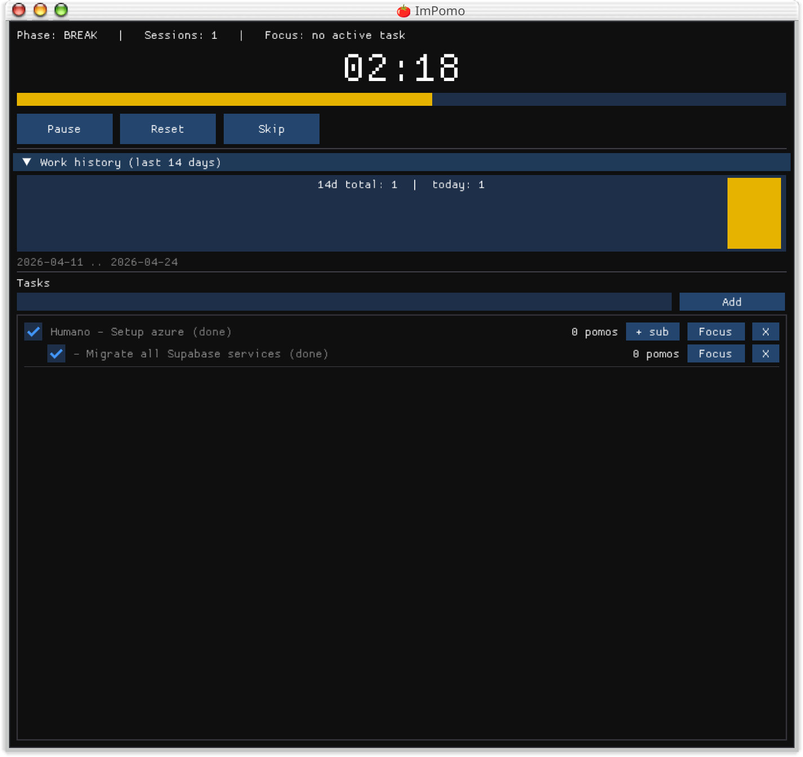

# impomo

a pomodoro app i built in one evening with dear imgui because i kept opening browser tabs just to kill a ticking timer. the little tomato lives in the taskbar now. it just sits there. counts down. saves. if i close the window mid-session and come back tomorrow, the countdown picks up like nothing happened.



## what it does

- 25 / 5 work and break cycles, the classic thing
- task list with one level of subtasks. hit focus, pomos count toward that specific task
- bar chart of pomos per day for the last 14 days so you can lie to yourself a little less
- timer state survives app restarts. wall-clock based, so it ticks while the app is closed
- clipart tomato in the taskbar, very official

## grab a release

ready builds on the [releases page](https://github.com/al3rez/impomo/releases):

- linux: `ImPomo-x86_64.AppImage` (chmod +x and run)
- macos: `ImPomo.dmg`
- windows: `ImPomo.exe`

## running it

you need imgui cloned next to this repo. on fedora:

```
sudo dnf install gcc-c++ glfw-devel
cd ~/code
git clone https://github.com/ocornut/imgui
git clone https://github.com/al3rez/impomo
cd impomo
make
./pomodoro
```

debian / ubuntu: `sudo apt install g++ libglfw3-dev` then same thing.

single binary. no config file. no daemon. no account. drops three txt files in whatever directory you run it from:

- `pomodoro_tasks.txt` for tasks
- `pomodoro_history.txt` for per-day counts
- `pomodoro_state.txt` for the live timer

they're plain text. go ahead and edit them. break one and the app shrugs and makes a new one.

## launcher entry (linux)

if you want it to show up in your app menu with the tomato icon:

```
mkdir -p ~/.local/share/applications ~/.local/share/icons/hicolor/256x256/apps
cp pomodoro.desktop ~/.local/share/applications/
cp icon.png ~/.local/share/icons/hicolor/256x256/apps/pomodoro.png
update-desktop-database ~/.local/share/applications
gtk-update-icon-cache ~/.local/share/icons/hicolor
```

on kde plasma you might have to restart plasmashell before the new icon shows up. it's a whole thing. `killall plasmashell && kstart plasmashell` does it.

## known weird stuff

glfw's wayland backend segfaults on `wl_display_disconnect` when the app exits. all saved data is already on disk by that point, so the code just calls `_Exit(0)` instead of a proper cleanup. the kernel reclaims everything. not proud of it but it works.

wayland also doesn't let apps set their own window icon from code, so you'll see a harmless `GLFW Error 65548` in stderr. the titlebar icon comes from the .desktop file and the hicolor theme, which is why the install step above matters.

## credit

- [dear imgui](https://github.com/ocornut/imgui) by omar cornut, does all the actual rendering
- [stb_image](https://github.com/nothings/stb) by sean barrett, vendored in for png decoding
- the tomato png is clipart i grabbed from my downloads folder on a sunday. origin uncertain. swap it out if you care about licensing.
